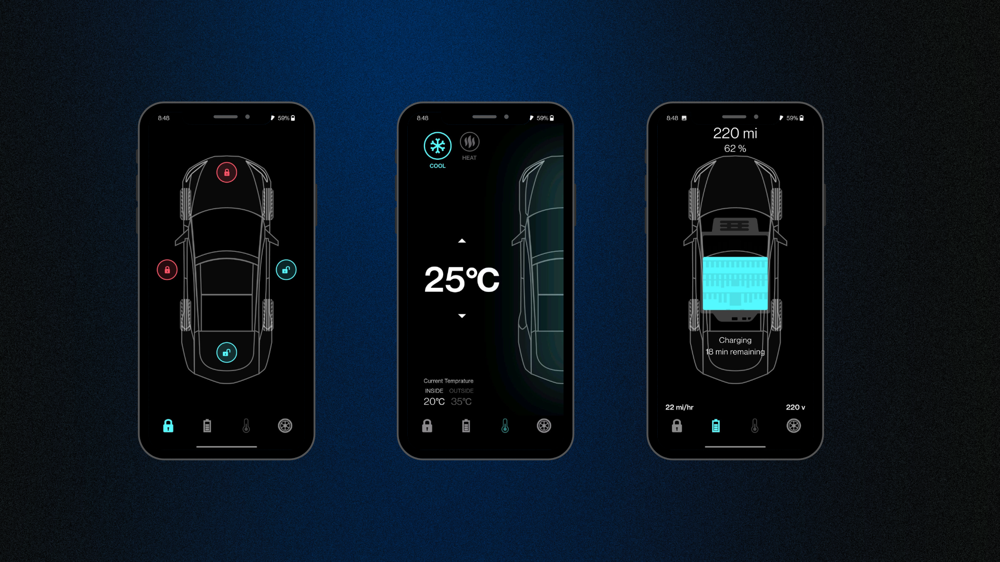

# Tesla Car Controller - Flutter UI App

Welcome to "Tesla Car UI," a Flutter UI application that offers an immersive experience of controlling a virtual Tesla car. With an elegant and user-friendly interface, you can effortlessly manage the car's temperature, lock and unlock doors, check tire status, and initiate a recharge. The app's fluid animations and seamless transitions enhance the sense of realism, making it a captivating user experience. "Tesla Car Controller" is an open-source project hosted on GitHub, allowing you to explore and appreciate the intricate UI design.

## Features

- **Virtual Car Controls:** Experience the thrill of managing a virtual Tesla car with a range of controls, including temperature adjustments, door locking and unlocking, tire status, and recharge initiation.

- **Fluid Animations:** Enjoy smooth and realistic animations that add to the immersive user experience.

- **User-friendly Interface:** The app's intuitive design ensures that users can easily navigate and interact with various car controls.

- **Realistic Transitions:** Seamlessly transition between different car states for a more authentic experience.

## Screenshots

## Getting Started

To get started with the Coffee app, follow these steps:

1. **Prerequisites:** Ensure you have Flutter installed on your system. If not, you can install it from the official Flutter website.

2. **Clone the Repository:** Clone this repository to your local machine using the following command:

3. **Install Dependencies:** Navigate to the project directory and install the required dependencies:

4. **Run the App:** Now, you can run the app on your connected device or emulator:

## Contributing

We welcome contributions from the community! If you'd like to contribute to the app, follow these steps:

1. Fork this repository.

2. Create a new branch for your feature or bug fix.

3. Make your changes and commit them with descriptive commit messages.

4. Push your changes to your forked repository.

5. Create a pull request to the `main` branch of this repository.

We'll review your pull request and merge it if everything looks good!

## Acknowledgements

We would like to thank the Flutter community for their support and contributions.

## Contact

If you have any questions or suggestions regarding the Coffee app, feel free to contact us at rh676838@gmail.com 

---
Thank you for joining us in this virtual Tesla car experience! We hope you enjoy controlling the car and exploring the app's intricate UI design. Happy driving! 🚗
